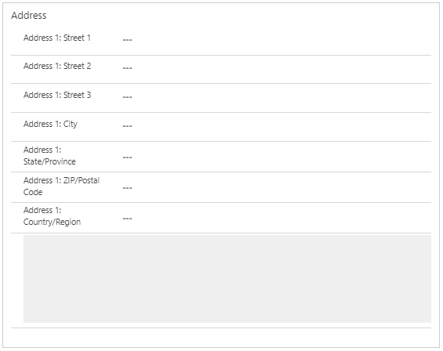

# Google Map PCF Control (GMapControl)
Google Maps PCF Control for PowerApps and Dynamics CRM/365

### Implementation: 

This is what the PCF looks like in action:

### Setup:

**Bind this control to the "Street 1" or "Address 1: Line 1" field. If you have a single text field for address, bind it to that.**

1. Add "Address1: Street 1" to the form, double click on the form and click Controls
2. Select Google Maps Control from the list.

3. Input the Google Maps API Key, specifically the "Maps Embed API". You can sign up for one here: https://console.developers.google.com/google/maps-apis
4. Select Web, Tablet, and Phone radio buttons next to the Google Maps Control.
5. Optionally, click on hide default control.

